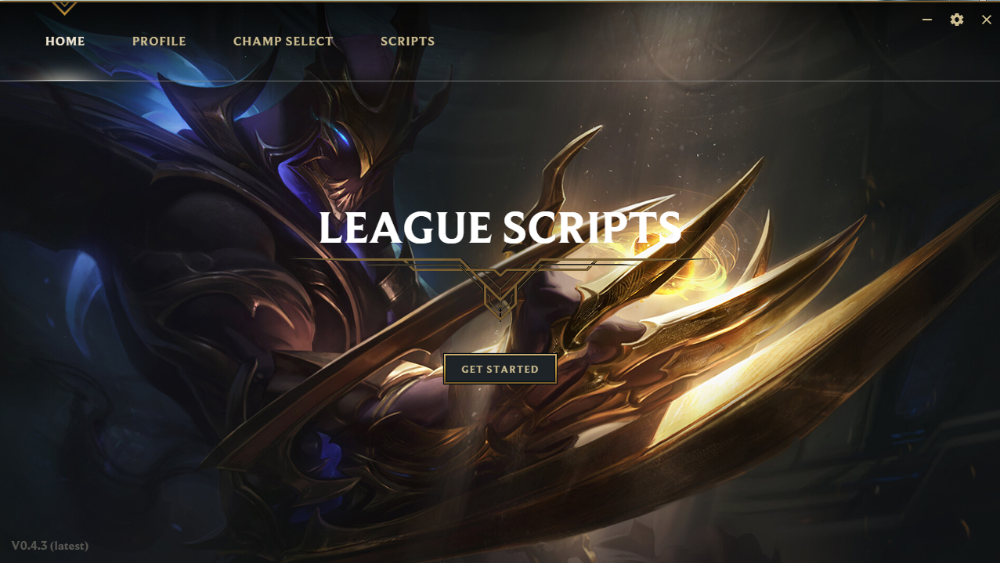
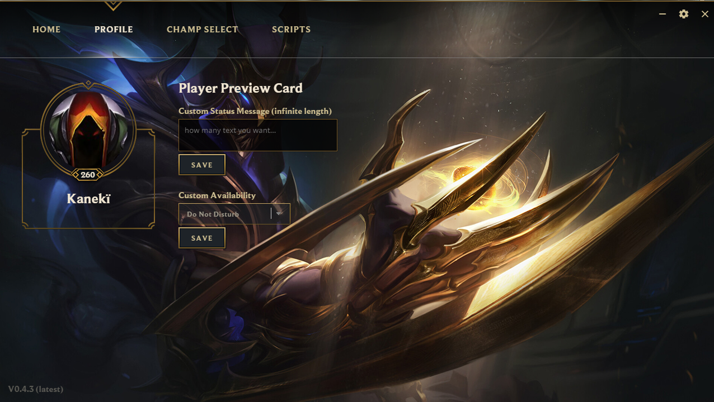

[](https://www.paypal.com/cgi-bin/webscr?cmd=_s-xclick&hosted_button_id=HX4ZA6BYJWESJ&source=url)
<p align="center">
  <a href="https://leaguescripts.io/" target="_blank"></a><br>
  <b>Useful Links:</b><br>
  <a href="https://engineering.riotgames.com/news/architecture-league-client-update" target="_blank">Inspiration</a> |
  <a href="https://leaguescripts.io/#preview" target="_blank">Preview</a> |
  <a href="https://leaguescripts.io/#features" target="_blank">Features</a>
  <br>
  <a href="https://github.com/hugogomess/league-scripts/releases" target="_blank" style="text-decoration: underline;"><b>Latest Release</b></a>
  <br>
</p>

League Scripts is a fork from [LeagueToolkit](https://github.com/4dams/LeagueToolkit), different from the original project this application is a set of useful scripts like an auto queue accept for example. For more info access [leaguescripts.io](https://leaguescripts.io)

## Preview




## How to dev

First you need to install NodeJS and NPM.

1. Install electronjs:

   ```console
   $ npm install -g electron
   ```

2. Install all dependencies, in project root directory: 
	
	```console
   $ npm install
   ```

3. Set dev environment variable: NODE_ENV=dev

4. Start app:

   ```console
   $ npm start
   ```

## Contributions

<a href="https://github.com/hugogomess"></a>
<a href="https://github.com/4dams"></a>
<a href="https://github.com/Xh4H"></a>

## Acknowledgments

* LeagueToolkit original project by [4adams](https://github.com/4dams)
* Connecting via [LCU Connector](https://www.npmjs.com/package/lcu-connector)
* Material icons provided by [Material.io](https://material.io/icons/)
* Design concepts by [React-Hextech](https://github.com/LeagueDevelopers/react-hextech)
* Made possible thanks to [Electron](https://electronjs.org/)

## Donation

If this project help you and you want to help us to continue the project you can give us a donantion :)
<br/>
<br/>
[](https://www.paypal.com/cgi-bin/webscr?cmd=_s-xclick&hosted_button_id=HX4ZA6BYJWESJ&source=url)
